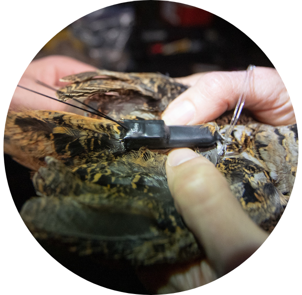
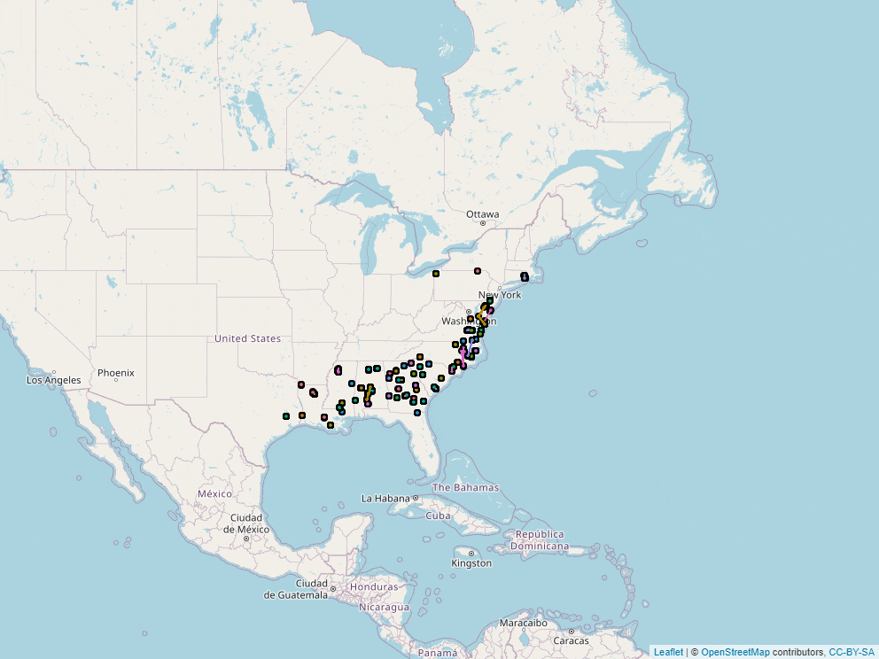

<hr />
## Exploring woodcock migration
<br>
<div class = row>
<div class = col-md-4>
<center>

</center>
</div>

<div class = col-md-8>
During my work with the Eastern Woodcock Migration Research Cooperative ([EWMRC](https://www.woodcockmigration.org/)) I built several tools to improve our ability to communicate results to the public. The first is the [Migration Exploration App](https://www.woodcockmigration.org/migration.html), which is used in concert with our weekly updates to update the public on the migratory routes and timing of tagged woodcock. The second application is the [Historical Data Exploration App](https://www.woodcockmigration.org/explore-data.html), which allows users to view full migrations from over 500 tagged woodcock throughout the course of the project.
<br>
<br>
<center>


</center>
</div>
</div>
<hr />
## Interactive habitat prioritization tools
<br>
<div class = row>
<div class = col-md-4>
<center>

</center>
</div>

<div class = col-md-8>
During a collaborative project with the [Pennsylvania Game Commission](www.google.com), we built an application to allow PGC employees to interactively weight migratory and breeding season habitat suitability when making woodcock habitat conservation decisions. The resulting tool, called [W-PAST](https://woodcock.shinyapps.io/W-PAST), has since been used to inform state-level management and support woodcock habitat funding proposals in Pennsylvania.
<center>

</center>
</div>
</div>

```{r, echo=FALSE, fig.cap = "Land cover at Heiberg Memorial Forest (Tully, NY) in 1936 (top) and 2015 (bottom).", fig.show='hold', fig.align='center'}
#knitr::include_app(" https://woodcock.shinyapps.io/migration_explore_app/?_ga=2.264268303.1601805311.1674332143-1264357510.1664990729", height = "600px")
``` 

