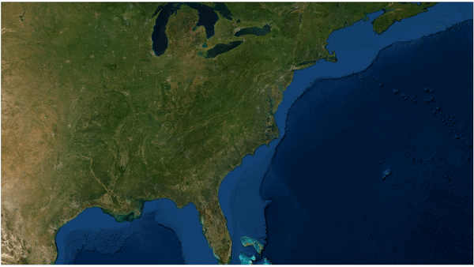

<div class = row>
<div class = col-md-6>
```{r, echo=FALSE, fig.cap = "Yours truly", fig.show='hold', fig.align='center'}
knitr::include_graphics("images/K.L. Akerlof 1122-20.jpg")
```
</div>

<div class = col-md-6>
I am currently a doctoral candidate at the [University of Maine](https://www.umaine.edu) in the Department of Wildlife, Fisheries, and Conservation Biology. My work focuses on the movements, habitat use, and population dynamics of wildlife, especially bird species. I have particular interests in migration and the conservation of at-risk species through techniques such as translocation.

I am also passionate about the effective communication of results and scientific recommendations to wildlife agencies and the public. Some of my recent work has used [Shiny](https://www.shinyapps.io/) applications as an interactive platform to allow stakeholders to access data and results. I've included a gallery of those applications [here](applications.html).

My CV is available [here](files/Liam_Berigan_CV_12_4_2022.pdf).
</div>
</div>

<hr />
<center>


</center>