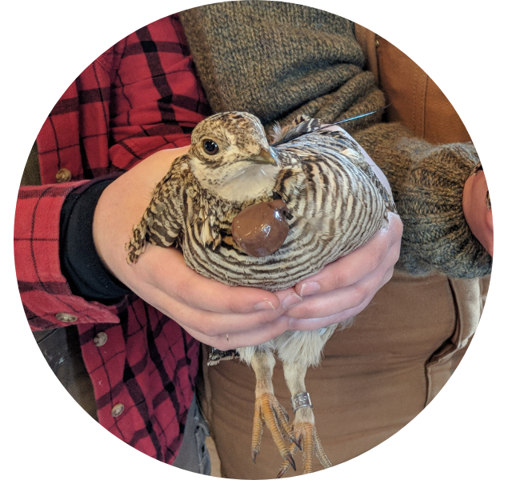

## Migratory strategies and habitat use

lorem ipsum

## Conservation of at-risk species

**Berigan, L. A.**, Aulicky, C. S., Teige, E. C., Sullins, D. S., Haukos, D. A., Fricke, K. A., ... & Ricketts, A. M. (2022). Availability of lesser prairie‐chicken nesting habitat impairs restoration success. Wildlife Society Bulletin, 46(5), e1379. [PDF](files/Berigan_LPCHabitat_2022.pdf)

**Berigan, L. A.** (2019). Dispersal, reproductive success, and habitat use by translocated lesser prairie-chickens (Master's thesis). [PDF](files/Berigan_MastersThesis.pdf)

## Urban bird declines

**Berigan, L. A.**, Greig, E. I., & Bonter, D. N. (2020). Urban House Sparrow (*Passer domesticus*) populations decline in North America. The Wilson Journal of Ornithology, 132(2), 248-258. [PDF](files/Berigan_HouseSparrow_2020.pdf)

