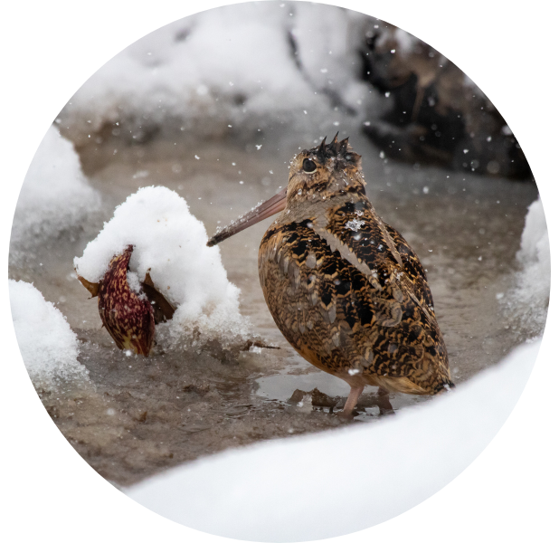
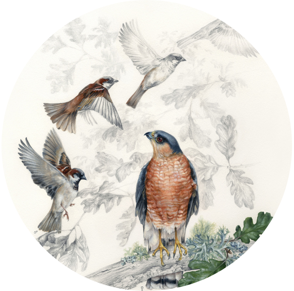

## Movement & habitat ecology
 

Recent focus on migratory bird declines have led to increased interest in how birds move and use habitat throughout their full annual cycle. The [EWMRC](www.woodcockmigration.org) has been examining migratory bird movement ecology and habitat selection using migratory data from >500 GPS-tagged American Woodcock. While this work is in progress, one of our early products is the Woodcock Priority Area Siting Tool ([W-PAST](https://woodcock.shinyapps.io/W-PAST); see our summary on the [applications page](applications.html)).
 
 
Some of our early insights are that woodcock have a tendency to make notable movements outside of the migratory season. Woodcock frequently make extended movements in the wintering and breeding seasons, either as exploratory loops or one-way dispersal events, and occasionally even initiate southerly migration during the late breeding season (June - August). Woodcock also exhibit partial migration at southern and mid-Atlantic latitudes, and make movements resembling facultative migration along the mid-Atlantic coast.

*Popular science presentations:* [Harris Center](https://www.youtube.com/watch?v=ivrPYA-CgBI&ab_channel=HarrisCenter), [Friends of Mississquoi NWR](https://www.youtube.com/watch?v=PAqzFuZ15Mo&ab_channel=FriendsofMissisquoi)

## Conservation of at-risk species
 

Lesser prairie-chickens have recently been listed under the U.S. Endangered Species Act due to widespread declines throughout most of their range. To combat these declines, a collaborative federal, state, and university effort translocated 411 lesser prairie-chickens to unoccupied areas of presumed habitat in the Sand Sagebrush Prairie Ecoregion. During the translocation, we conducted an assessment of lesser prairie-chicken habitat requirements in areas where birds were released (especially the [Cimarron](https://www.fs.usda.gov/recarea/psicc/recarea/?recid=12404) and [Comanche](https://www.fs.usda.gov/detail/psicc/about-forest/districts/?cid=fsm9_032695) National Grasslands) and found that areas of Sand Sagebrush prairie which had formerly hosted lesser prairie-chickens no longer contained sufficient nesting habitat for their persistence.
 
 
We also found that lesser prairie-chicken dispersal after translocation was almost universal, and resulted in the diffusion of the translocated population across an area totalling nearly 4,000 square kilometers (~1.25x the size of Rhode Island). We're currently working to publish our results to ensure that the role of translocation is carefully evaluated before it is used in the restoration of this iconic prairie species.
 
 
**Berigan, L. A.**, Aulicky, C. S., Teige, E. C., Sullins, D. S., Haukos, D. A., Fricke, K. A., ... & Ricketts, A. M. (2022). Availability of lesser prairie‐chicken nesting habitat impairs restoration success. Wildlife Society Bulletin, 46(5), e1379. [PDF](files/Berigan_LPCHabitat_2022.pdf)

**Berigan, L. A.** (2019). Dispersal, reproductive success, and habitat use by translocated lesser prairie-chickens (Master's thesis). [PDF](files/Berigan_MastersThesis.pdf)

*Use in listing decisions:* [Federal Register 87(226), page 72739](files/Federal_Register_2022_listing.pdf)

*Media:* <a href="https://www.cbsnews.com/colorado/news/lesser-prairie-chickens-kansas-colorado-grasslands/" target="_blank">CBS News</a>, <a href="https://www.denverpost.com/2022/12/08/prairie-chicken-endangered-rescue-colorado/" target="_blank">Denver Post</a>, <a href="https://boulderweekly.com/news/midnight-on-the-prairie/" target="_blank">Boulder Weekly</a>, <a href="https://coloradooutdoorsmag.com/2020/07/27/conservation-update-lesser-prairie-chickens/" target="_blank">Colorado Outdoors Magazine</a>, <a href="https://northfortynews.com/category/news/four-year-project-sees-hundreds-of-lesser-prairie-chickens-reintroduced/" target="_blank">North Forty News</a>

## Urban bird declines
 

[Nearly 3 billion birds](https://www.birds.cornell.edu/home/bring-birds-back/) have disappeared from North America since 1970, in large part due to massive declines in abundance among common bird species. Our team used citizen science data collected by [Project Feederwatch](https://feederwatch.org/) to measure trends in House Sparrow abundance and evaluate potential reasons for their disappearance. We found that House Sparrow declines were closely linked to highly-urbanized landscapes, and did not appear to be related to the resurgence in *Accipiter* hawk populations that contributed to declines in Europe. The cause of House Sparrow declines in North America is likely tightly linked to urban landscapes, and may include the modification of urban greenspaces or feral cat populations. Our results were published in the Wilson Journal of Ornithology in 2020.
 
 
**Berigan, L. A.**, Greig, E. I., & Bonter, D. N. (2020). Urban House Sparrow (*Passer domesticus*) populations decline in North America. The Wilson Journal of Ornithology, 132(2), 248-258. [PDF](files/Berigan_HouseSparrow_2020.pdf)

*Media:* [ScienceDaily](https://www.sciencedaily.com/releases/2021/02/210211114002.htm), [New York Almanac](https://www.newyorkalmanack.com/2021/02/even-the-common-house-sparrow-is-in-decline-study-finds/), [Grand Forks Herald](https://www.grandforksherald.com/sports/northland-outdoors/always-in-season-mike-jacobs-house-sparrow-numbers-continue-long-term-decline)

